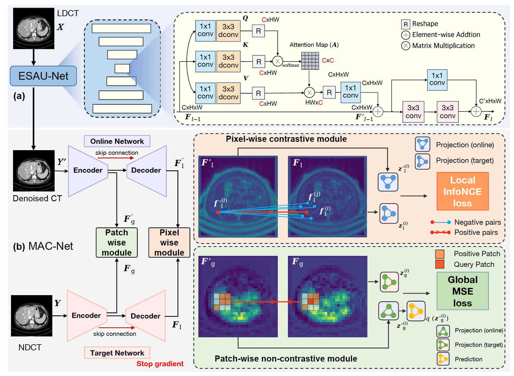

# ASCON: Anatomy-aware Supervised Contrastive Learning Framework for Low-dose CT Denoising
This is the official implementation of the paper " ASCON: Anatomy-aware Supervised Contrastive Learning Framework for Low-dose CT Denoising" in 26th International Conference on Medical Image Computing and Computer Assisted Intervention (MICCAI 2023). The pre-print version can be found in [arxiv](https://arxiv.org/abs/2307.12225); camera-ready version will be soon released.

## Updates
Sep, 2023: initial commit.

## Approach


## Data Preparation
The 2016 AAPM-Mayo dataset can be downloaded from: [CT Clinical Innovation Center](https://ctcicblog.mayo.edu/2016-low-dose-ct-grand-challenge/)
The 2020 AAPM-Mayo dataset can be downloaded from: [cancer imaging archive](https://wiki.cancerimagingarchive.net/pages/viewpage.action?pageId=52758026)   
#### Dataset structre:
```
Mayo2016_2d/
  |--train/
      |--quarter_1mm/
        train_quarter_00001.npy
        train_quarter_00002.npy
        train_quarter_00003.npy
        ...
      |--full_1mm/
        train_full_00001.npy
        train_full_00002.npy
        train_full_00003.npy
        ...
  |--test/
      |--quarter_1mm
      |--full_1mm
```

## Requirements
```
- Linux Platform
- torch==1.12.1+cu113 # depends on the CUDA version of your machine
- torchvision==0.13.1+cu113
- Python==3.8.0
- numpy==1.22.3
```

## Traning and & Inference
Training
```
python train.py  --name ASCON(experiment_name)   --model ASCON  --netG  ESAU  --dataroot /data/zhchen/Mayo2016_2d(path to images) --nce_layers  1,4 --layer_weight 1,1  --num_patches 32,512  --k_size 3,7 --lr 0.0002 --gpu_ids 6,7 --print_freq 25 --batch_size 1 --lr_policy cosine
```

Inference & testing
```
python test.py  --name ASCON(experiment_name)   --model ASCON  --netG ESAU --results_dir test_results --result_name ASCON_results(path to save image)   --gpu_ids 6 --batch_size 1 --eval
```
Please refer to options files for more setting.


## Citation
If you find our work and code helpful, please kindly cite the corresponding paper:
```
@article{chen2023ascon,
  title={ASCON: Anatomy-aware Supervised Contrastive Learning Framework for Low-dose CT Denoising},
  author={Chen, Zhihao and Gao, Qi and Zhang, Yi and Shan, Hongming},
  journal={MCCAI 2023},
  year={2023}
}
```
